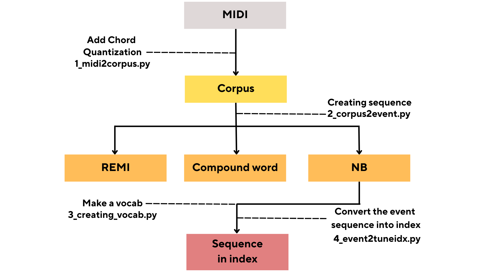

# Data Representation

This document outlines our standard data processing pipeline. By following the instructions and running the corresponding Python scripts, you can generate a data representation suited to your specific needs.

We focus on symbolic music and limit the use of musical features to a select few. Each feature set size corresponds to specific musical attributes. Through various experiments, we decided to use **7 features** for the *Pop1k7* and *Pop909* datasets, which consist of pop piano music requiring velocity for expression, and **5 features** for the *Symbolic Orchestral Database (SOD)*, *Lakh MIDI*, and *SymphonyMIDI* datasets.

- **4 features**: `["type", "beat", "pitch", "duration"]`
- **5 features**: `["type", "beat", "instrument", "pitch", "duration"]`
- **7 features**: `["type", "beat", "chord", "tempo", "pitch", "duration", "velocity"]`
- **8 features**: `["type", "beat", "chord", "tempo", "instrument", "pitch", "duration", "velocity"]`

## Parse Argument
- `-d`, `--dataset`: This required argument specifies the dataset to be used. It takes one of the following values: `"BachChorale"`, `"Pop1k7"`, `"Pop909"`, `"SOD"`, `"LakhClean"`, or `"SymphonyMIDI"`.
  
- `-e`, `--encoding`: This required argument specifies the encoding scheme to use. It accepts one of the following: `"remi"`, `"cp"`, `"nb"`, or `"remi_pos"`.

- `-f`, `--num_features`: This required argument specifies the number of features. It can take one of the following values: `4`, `5`, `7`, or `8`.

- `-i`, `--in_dir`: This optional argument specifies the input data directory. It defaults to `../dataset/represented_data/corpus/` if not provided.

- `-o`, `--out_dir`: This optional argument specifies the output data directory. It defaults to `../dataset/represented_data/events/`.

- `--debug`: This flag enables debug mode when included. No additional value is needed.

## 1. MIDI to Corpus
In this step, we convert MIDI files into a set of events containing various musical information. The MIDI files should be aligned with the beat and contain accurate time signature information. Place the MIDI files in `<nmt/dataset/MIDI_dataset>` and refer to the example files provided. Navigate to the `<nmt/data_representation>` folder and run the script. The converted data will be stored in `<nmt/dataset/represented_data/corpus>`.

- Example usage: `python3 1_midi2corpus.py --dataset SOD --num_features 5`

## 2. Corpus to Event
We provide three types of representations: **REMI**, **Compound Word (CP)**, and **Note-based Encoding (NB)**. The converted data will be stored in `<nmt/dataset/represented_data/events>`.

- Example usage: `python3 2_corpus2event.py --dataset SOD --num_features 5 --encoding nb`

## 3. Creating Vocabulary
This script creates a vocabulary in the `<nmt/vocab>` folder. The vocabulary includes event-to-index pair information.

- Example usage: `python3 3_creating_vocab.py --dataset SOD --num_features 5 --encoding nb`

## 4. Event to Index
In this step, we convert events into indices for efficient model training. The converted data will be stored in `<nmt/dataset/represented_data/tuneidx>`.

- Example usage: `python3 4_event2tuneidx.py --dataset SOD --num_features 5 --encoding nb`